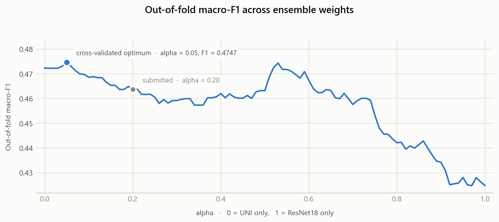

# Histopathology Molecular Subtype Classification

[](https://github.com/RenatoGallicola/histopathology-subtype-classification/actions/workflows/ci.yml)
[](https://www.python.org/downloads/)
[](LICENSE)

Given a low-magnification whole-slide image of human tissue, predict its molecular
subtype: `Luminal A`, `Luminal B`, `HER2(+)` or `Triple negative`. The label
describes the tumour's biology, which is not something a single glance at the
slide reveals — it has to be inferred from cellular morphology scattered across a
very large image, from 627 training slides.

Built for the second challenge of *Artificial Neural Networks and Deep Learning*
(AN2DL), Politecnico di Milano, A.Y. 2025/26.

| Task | Four-class molecular subtype classification of whole-slide images |
|---|---|
| **Data** | 627 training slides with out-of-fold predictions, 477 test slides, one annotation mask per slide |
| **Class balance** | 174 / 219 / 158 / 76 (`Luminal A` / `Luminal B` / `HER2(+)` / `Triple negative`) |
| **Metric** | F1-score |
| **Final architecture** | Weighted ensemble of a ResNet18 tile classifier with dihedral TTA and a linear head over frozen [UNI](https://huggingface.co/MahmoodLab/UNI) embeddings |
| **Test F1** | **0.4304** [^lb] |
| **Out-of-fold macro-F1** | 0.4637 for the submitted weight, 0.4747 at the cross-validated optimum |
| **Framework** | PyTorch, timm |

[^lb]: Leaderboard score, as recorded in the submitted report. Out-of-fold figures
on this page are recomputed from the artifacts in this repository.

**The model-selection stage is reproducible in seconds, without the dataset, a GPU
or the gated UNI weights** — the per-slide out-of-fold probabilities of both
branches are committed:

```bash
python scripts/ablation.py    # the results table below
python scripts/tune_alpha.py  # the ensemble weight search
```

---

## The approach in one picture

```
whole-slide image + annotation mask
      |
      +-- tissue mask, blob removal, 256x256 tiles (stride 128)
              |
              +--> ResNet18 tile classifier ------> dihedral TTA --.
              |    (ImageNet pretrained)            (8 views)       |
              |                                                     +--> 0.20 / 0.80
              +--> UNI frozen ViT --> linear head ------------------'    weighted mean
                   (histopathology pretrained)                              |
                                                                            v
                                                        mean over tiles -> slide prediction
```

Three ideas carry the solution:

1. **Tiles instead of whole slides.** The slides are large and of heterogeneous
   size; resizing one to fit a network destroys exactly the cellular detail the
   subtypes differ by. Cutting each slide into 256×256 tiles at native resolution
   and averaging the tile predictions turns one hard image into a bag of readable
   ones — the multiple-instance learning framing. Every split is grouped by slide,
   so no slide contributes tiles to both sides of a fold.

2. **A pathology foundation model beats a fine-tuned CNN.** UNI is a Vision
   Transformer pretrained on roughly 100M histopathology images. Frozen, with
   nothing but a two-layer head trained on top, it reaches 0.4723 out-of-fold
   macro-F1 against the ResNet18's 0.4248. On 627 slides there is not enough data
   to learn features this good from scratch, so the right move is to borrow them.

3. **Let the data set the mixing weight.** The two branches are combined as
   `alpha · P_ResNet + (1 − alpha) · P_UNI`, with `alpha` chosen by grid search on
   out-of-fold probabilities rather than by hand. Replacing a hand-picked weight
   with a cross-validated one was worth +0.0214 test F1 on its own.

Full write-up: [`report/`](report/AN2DL_2025_Challenge2_Report.pdf) (3 pages).
The architectures explored along the way: [`docs/EXPERIMENTS.md`](docs/EXPERIMENTS.md).

---

## Results

<picture>
  <source media="(prefers-color-scheme: dark)" srcset="assets/progression-dark.png">
  
</picture>

Every stage earned its place. The move from whole slides to tiles is what unlocked
the rest; adding UNI was the largest single gain of the challenge (+0.0161);
cross-validating the mixing weight added another +0.0214; dihedral test-time
augmentation on the ResNet branch closed with +0.0070.

The weight the search settles on says something about the two branches:

<picture>
  <source media="(prefers-color-scheme: dark)" srcset="assets/alpha-curve-dark.png">
  
</picture>

Out of fold, the best weight sits near `alpha = 0.05`: the ensemble is almost pure
UNI, and performance falls away steadily as the ResNet branch is given more say.
The submitted run uses `alpha = 0.20` deliberately — dihedral TTA is applied to the
ResNet branch at inference but not during cross-validation, so at test time that
branch is stronger than these curves can show.

| Configuration | macro-F1 | weighted-F1 | accuracy |
|---|---:|---:|---:|
| ResNet18 tiles, alone | 0.4248 | 0.4262 | 0.4258 |
| UNI linear head, alone | 0.4723 | 0.4693 | 0.4705 |
| Ensemble, `alpha = 0.04` (cross-validated) | 0.4731 | 0.4709 | 0.4721 |
| Ensemble, `alpha = 0.20` (submitted) | 0.4637 | 0.4616 | 0.4625 |

Out of fold over the 627 training slides. Regenerate with `python scripts/ablation.py`.

Per-class figures, the confusion matrix and how these relate to the report's
table: [`docs/RESULTS.md`](docs/RESULTS.md).

---

## Reproducing the results

Training ran on Google Colab GPUs and takes hours. The model-selection stage,
however, runs on a laptop in seconds, because the per-slide out-of-fold
probabilities of both branches are committed to `artifacts/`.

```bash
pip install -r requirements.txt

# Recompute the results table, the per-class breakdown and the confusion matrix.
python scripts/ablation.py

# Replay the ensemble weight search.
python scripts/tune_alpha.py

# Redraw the figures.
python scripts/make_figures.py
```

None of these needs the dataset, a GPU, PyTorch, or access to the gated UNI
weights.

The test suite covers the same ground, plus the tiling, pooling and submission
logic:

```bash
pip install -e ".[dev]"
pytest
```

CI runs the suite on Python 3.10 and 3.12 on every push, alongside both scripts
and a validity check over the notebooks.

To retrain from scratch you additionally need the competition data (see
[`data/README.md`](data/README.md)), a GPU runtime, and a Hugging Face account
approved for [UNI](https://huggingface.co/MahmoodLab/UNI); then run
[`notebooks/01_preprocessing_and_tiles.ipynb`](notebooks/01_preprocessing_and_tiles.ipynb)
followed by
[`notebooks/02_full_pipeline.ipynb`](notebooks/02_full_pipeline.ipynb).

---

## Repository layout

```
notebooks/
  01_preprocessing_and_tiles.ipynb  slide cleaning, tissue masks, tile extraction
  02_full_pipeline.ipynb            the submitted solution, end to end, with outputs
  experiments/                      eight notebooks: the four stages of the
                                    progression, and four discarded approaches
src/
  config.py       every hyperparameter of the final run, in one place
  data.py         tile dataset, dihedral augmentation, slide index, class weights
  models.py       ResNet18 branch, frozen UNI backbone, UNI classifier head
  inference.py    slide-level pooling and dihedral test-time augmentation
  ensemble.py     weight search and blending
  submission.py   submission writing and validation
scripts/
  ablation.py       recompute the results table from the committed probabilities
  tune_alpha.py     replay the ensemble weight search
  make_figures.py   redraw the figures
tests/            windowing and pooling, TTA invariance, weight search,
                  submission validation, and the documented results
artifacts/        per-slide out-of-fold probabilities for both branches
data/             cleaned label file and dataset instructions (images not included)
models/           how to regenerate the weights (the checkpoints are not committed)
report/           the 3-page report submitted for grading
submissions/      the predictions submitted at each stage
docs/             RESULTS.md, EXPERIMENTS.md
assets/           figures, light and dark
```

`src/` is a faithful extraction of the notebook code, so the models and the
pipeline can be read without opening the notebooks. The notebooks remain the
authoritative record of what was executed: they carry the training logs of the
submitted run.

**Reading order**, if you want the code rather than the results:
[`src/config.py`](src/config.py) for every hyperparameter that matters, then
[`src/data.py`](src/data.py) for the tiling and the slide index the whole pipeline
rests on, [`src/inference.py`](src/inference.py) for the pooling and the
test-time augmentation, and [`src/ensemble.py`](src/ensemble.py) for the weight
search.

---

## License

Code released under the [MIT License](LICENSE). The dataset belongs to the AN2DL
course and is not redistributed here; UNI is subject to
[its own licence](https://huggingface.co/MahmoodLab/UNI).
