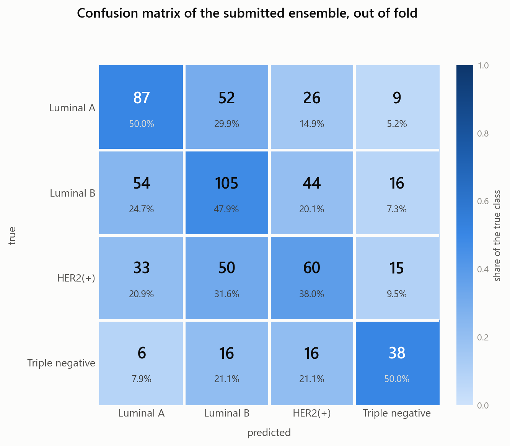
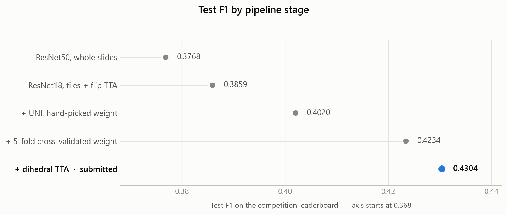

# Results

Two kinds of number appear on this page and they are kept apart.

* **Out-of-fold** — recomputed from `artifacts/oof_slide_probs_5fold.npz` by
  `scripts/ablation.py`. Anyone cloning this repository gets the same values.
  These are macro-F1 over the 627 training slides, from models that never saw the
  slide they are scoring.
* **Test F1** — the competition leaderboard, quoted from the submitted report.
  Scored against labels we never had, so it cannot be recomputed here.

The two are not comparable in level: out-of-fold macro-F1 sits around 0.46–0.47
while leaderboard F1 sits around 0.43, on different slides and a different metric
average.

---

## Out-of-fold ablation

Run `python scripts/ablation.py` to regenerate.

| Configuration | macro-F1 | weighted-F1 | accuracy |
|---|---:|---:|---:|
| ResNet18 tiles, alone | 0.4248 | 0.4262 | 0.4258 |
| UNI linear head, alone | 0.4723 | 0.4693 | 0.4705 |
| Ensemble, `alpha = 0.04` (cross-validated) | 0.4731 | 0.4709 | 0.4721 |
| Ensemble, `alpha = 0.20` (submitted) | 0.4637 | 0.4616 | 0.4625 |
| Best weight on the grid (`alpha = 0.05`) | 0.4747 | — | — |

### What the ablation says

* **The frozen foundation model is the stronger branch by a wide margin.** UNI
  alone beats the fine-tuned ResNet18 by 4.75 macro-F1 points, without a single
  gradient reaching its backbone. On 627 slides, borrowing a representation built
  on 100M histopathology images beats learning one.
* **The ensemble adds little on top of UNI.** 0.4731 at the cross-validated weight
  against 0.4723 for UNI alone: the ResNet branch contributes, but marginally, and
  the optimum sits at `alpha = 0.05` — roughly 95% UNI. This is consistent with
  the two branches making correlated mistakes on the slides that are genuinely
  ambiguous.
* **The weight is only loosely determined.** `scripts/tune_alpha.py` reports 17 of
  the 101 grid points within 0.005 of the best score, spanning `alpha` from 0.00
  to 0.59, and the curve is not unimodal — there is a second local peak near
  `alpha = 0.53` almost as high as the global one. On this many slides the search
  is choosing between weights whose difference is inside the noise.

---

## Per class, at the submitted weight

`alpha = 0.20`, out of fold:

| Class | Precision | Recall | F1 | Support |
|---|---:|---:|---:|---:|
| `Luminal A` | 0.4833 | 0.5000 | 0.4915 | 174 |
| `Luminal B` | 0.4709 | 0.4795 | 0.4751 | 219 |
| `HER2(+)` | 0.4110 | 0.3797 | 0.3947 | 158 |
| `Triple negative` | 0.4872 | 0.5000 | 0.4935 | 76 |
| **accuracy** | | | **0.4625** | 627 |
| **macro avg** | 0.4631 | 0.4648 | 0.4637 | 627 |

<picture>
  <source media="(prefers-color-scheme: dark)" srcset="../assets/confusion-matrix-dark.png">
  
</picture>

```
                  Luminal A  Luminal B  HER2(+)  Triple negative
  Luminal A              87         52       26                9
  Luminal B              54        105       44               16
  HER2(+)                33         50       60               15
  Triple negative         6         16       16               38
```

Two observations. `Triple negative` is the rarest class at 76 slides and yet the
best-scoring one — its morphology is the most distinctive. The confusions
concentrate between `Luminal A` and `Luminal B`, which is the biologically
expected place for them: the two differ by proliferation rate rather than by an
obviously different tissue architecture.

The absolute level is worth putting in context. Four classes with this balance
give a majority-class baseline of 0.349 accuracy and 0.129 macro-F1; the ensemble
reaches 0.4625 and 0.4637. Molecular subtype is only partially determined by
morphology at this magnification, which is why the whole leaderboard sits far
below the numbers a natural-image benchmark would produce.

---

## Test F1 by pipeline stage

From the submitted report.

| Stage | Test F1 | Gain |
|---|---:|---:|
| ResNet50, whole slides | 0.3768 | — |
| ResNet18, tiles + flip TTA | 0.3859 | +0.0091 |
| + UNI, hand-picked weight | 0.4020 | +0.0161 |
| + 5-fold cross-validated weight | 0.4234 | +0.0214 |
| **+ dihedral TTA, submitted** | **0.4304** | +0.0070 |

<picture>
  <source media="(prefers-color-scheme: dark)" srcset="../assets/progression-dark.png">
  
</picture>

---

## The two values of alpha

The report and this repository both record two ensemble weights, and the
difference is intentional.

`alpha = 0.04` is what the grid search selected on out-of-fold probabilities,
where neither branch uses test-time augmentation. `alpha = 0.20` is what produced
`submissions/submission_final.csv`: at inference the ResNet branch is evaluated
under the full dihedral group, eight views per tile, which makes it a more
reliable contributor than the cross-validation could measure. The weight was
raised to reflect that.

`src/config.py` records both, as `ENSEMBLE.alpha_cv` and `ENSEMBLE.alpha_shipped`.

---

## Submitted predictions

`submissions/submission_final.csv`, 477 slides:

| Class | Predicted slides |
|---|---:|
| `Luminal B` | 192 |
| `HER2(+)` | 135 |
| `Luminal A` | 108 |
| `Triple negative` | 42 |

Earlier stages are kept alongside it — `submission_resnet18_tiles.csv`,
`submission_resnet_uni.csv` and `submission_5fold_alpha004.csv` — so the
progression can be inspected prediction by prediction. The final submission and
the 5-fold one agree on 95.8% of slides, which is the expected effect of moving
`alpha` from 0.04 to 0.20 on top of TTA.

---

## Relationship to the report

`report/AN2DL_2025_Challenge2_Report.pdf` is the document submitted for grading in
December 2025 and is kept here unchanged. Its Table 1 reports leaderboard scores;
this page adds the out-of-fold view, which the leaderboard cannot give and which
is what the ensemble weight was actually selected on.
